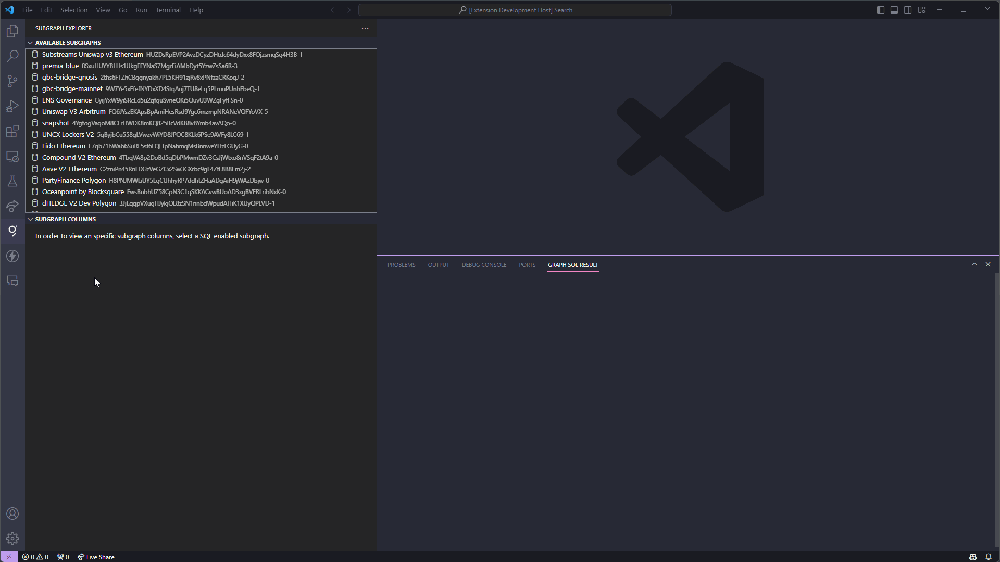

# semiotic-sql-studio README

The SQL studio enables developers to query SQL-enabled subgraphs on The Graph.

**IMPORTANT:** The only subgraph we currently support is Substreams Unisway v3 Ethereum (ID: HUZDsRpEVP2AvzDCyzDHtdc64dyDxx8FQjzsmqSg4H3B).

## Demo

For now, we instead give an example workflow to get you started.

1. Open the extension on the *Activity Bar*
2. Select the Substreams Unisway v3 Ethereum subgraph (ID: HUZDsRpEVP2AvzDCyzDHtdc64dyDxx8FQjzsmqSg4H3B). You'll know it's selected when the icon next to it becomes a green circle.
3. Run `New Query` or click on the new file button that you see when you hover your mouse over the *Available Subgraphs* menu. This will create a GSQL file with the ID field pre-populated.
4. Type in a query. For instance, `SELECT * FROM token LIMIT 1;`
5. Run the query using either the `Run Query` command or `C-m C-r`

<!--

-->

## Features

- View most signalled subgraps on the network
- Use `New Query` menu for creating an sql document
- View subgraph database layout
- Supports dragging and dropping database table and columns into the sql text editor
- Syntax highlighting and autocompletion
- From the command menu `C-S-p`, you have access to all commands with the heading `GRAPHSQL`. These include:
  - `New Query` - Create a GSQL window to write a new query. If you've already selected a subgraph in the *Available Subgraphs* menu, it will automatically populate the `ID` field in the document.
  - `Add Subgraph ID` (`C-m C-a`) - If you haven't yet added a subgraph ID to the document, it will add the ID of the currently selected subgraph.
  - `Replace Subgraph ID` (`C-m C-p`) - If there is no subgraph ID in the document, add the currently selected one. If there is, replace it with the currently selected one.
  - `Run Query` (`C-m C-r`) - Execute the query.
  - `Cancel Query` (`C-m C-c`) - Cancel execution.
  - `Show Results` (`C-m C-n`) - Show the results of the executed query.
  - `Load Most Signalled Subgraphs` (`C-m C-l`) - Load the available subgraphs by signalled amount.
  - `Search Subgraph by Name and Description` (`C-m C-s`) - Search the subgraph by its name and description
- View result table with
  - Sort by clicking column names
  - Search all text
  - Export to CSV
- Properties in custom GSQL filetype enable easy sharing of files between team members.

## Requirements

## Extension Settings

This extension contributes the following settings:

- `graphsql.gateway`: Gateway url to execute sql graphql against.
- `graphsql.paths`: Maps indexed subgraphs to paths by name for the gateway url.

## Known Issues

## Release Notes
