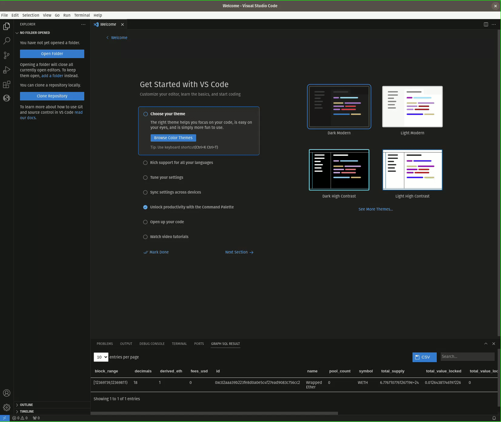
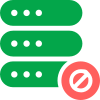

# semiotic-sql-studio README

The SQL studio enables developers to query SQL-enabled subgraphs on The Graph.

## Demo



1. Open the extension on the *Activity Bar*
2. Select the `Uniswap V3 Ethereum` subgraph by clicking on it.
3. At the top of the *Available Subgraphs* explorer, click on the *New Query* button. This will create a GSQL file with the ID field pre-populated.
4. Type in a query. For instance, `SELECT * FROM token LIMIT 5;`. Capitalization matters.
5. Run the query using either the `Semiotic SQL: Run Query` command or the keybinding `C-m C-r`
6. Enter your API Key if prompted. If you just created an API key, be aware that it may take up to 30 seconds for it to be registered.

If you need an API key, you can create one on [sql.semiotic.ai](sql.semiotic.ai).

You can clear your API key stored in vscode user session secrets by executing `Clear API Key` command.

## The Anatomy of the Subgraph Studio

Roughly speaking, we divide the Studio into two components.
The Explorer and the Playground.
We'll discuss each in turn below.

### The Explorer

The Explorer enables you to find subgraphs that you want to query.
The main interface to this is the *Available Subgraphs* view.
By default, this shows only subgraphs that have a SQL-enabled Indexer ready to serve you data.
We call these, SQL-enabled subgraphs as a shorthand, but this is a bit of a misnomer.
All subgraphs support SQL.
Just not all subgraphs have Indexers on them who are willing to serve SQL.
SQL-enabled subgraphs are marked by this symbol.


Alternatively, say you want to look at a subgraph that isn't SQL-enabled.
You can do that by searching for it using the keybinding `C-m C-s` or by moving your mouse to the top of the *Available Subgraphs* view and clicking on the magnifying glass.
With this, you can search either by the subgraph's name or by its description.
You might care to do this to inspect the queryable data on that subgraph.
Subgraphs that are not SQL-enabled are shown with this symbol.


Notice that the circle is blue for SQL-enabled subgraphs and red for subgraphs that aren't.
That's your clue.

There's one more distinction we need to make.
There are SQL-enabled and SQL-disabled subgraphs.
There are also selected subgraphs and unselected subgraphs.
When you select a subgraph, the gray part turns green.




What does it mean to select a subgraph?
Firstly, when you create a new query using the button at the top of the *Available Subgraphs* view or by right clicking a selected subgraph, the GSQL file fills in metadata for the selected subgraph.
More on this in a second.
Secondly, when you select a subgraph, the *Subgraph Tables* view updates to show schema information for that subgraph.
Let's talk about this next.

The *Subgraph Tables* view is a tree view.
At the top level, it shows the tables you can query in a subgraph.
If you expand one of those tables, you'll be able to see the columns and their types.
This view can help you write your queries, which moves us to the next part - the Playground.

### The Playground

Once you've used the Explorer to find a subgraph you want to query and create a new query, we open up a GSQL file for you.
This is a custom file type that contains comments at the top as metadata we use to query the subgraph.
Here's an example new file.

```sql
--+SUBGRAPH: Uniswap V3 Ethereum
--+ID: HMwbgUHTSUByt1wn939V7ZmtkLmZzSwDrQF8g735Ke7b
```

It contains two pieces of metadata.
The `+SUBGRAPH` field gives the name of the subgraph you are querying.
The `+ID` field is the ID of the subgraph you're querying.
We use the `+ID` here to determine which subgraph to execute your SQL query against.
**This means that if you select, say, the convex subgraph in the Explorer, but your GSQL file contains the ID for Uniswap V3 Ethereum, we will execute your query against Uniswap V3 Ethereum.**
We do this so that it's easier to share these files with your collaborators.
When you send them a file, you can guarantee that they're on the same subgraph as you.
However, in case you do want to change the metadata in a file to reflect your selected subgraph, you can do so with the keybinding `C-m C-p` or by running `Semiotic SQL: Replace the Metadata...`.
Similarly, if you manually create a GSQL file, you can add the selected subgraph's metadata to it using `C-m C-a` or by running `Semiotic SQL: Selected Subgraph's Metadata...`.

An advantage of the GSQL file is that we've built up a substantial SQL autocompletion engine that can help you fill in subgraph tables and columns into your query.
Just be aware that capitalization matters for SQL keywords.

Once you have a query you'd like to run, you can run it with either `C-m C-r` or by running `Semiotic SQL: Run Query`.
If this is your first time running a query, this will prompt you for an API key.
You can create one on [sql.semiotic.ai](sql.semiotic.ai).
That'll kick off the query.
If you realize you've made a mistake and want to cancel it, you can use `C-m C-c` or run `Semiotic SQL: Cancel Query`.
Otherwise, the query will pop up the *Semiotic SQL Result* view and display the table.
If you ever close this and want to reopen it, you can use `C-m C-n` or run `Semiotic SQL: Show Results`.

If you want to use this data, you can click on the CSV button above the table.
You can also sort by clicking column names in the table or search for specific text in the table.
If something went wrong, you can report a bug using `C-m C-b` or by running `Semiotic SQL: Report a Bug`.

## Commands

From the command menu `C-S-p`, you have access to all commands with the heading `Semiotic SQL`.

## Release Notes

See our [CHANGELOG](https://github.com/semiotic-ai/vscode-sql-studio/blob/main/CHANGELOG.md).
